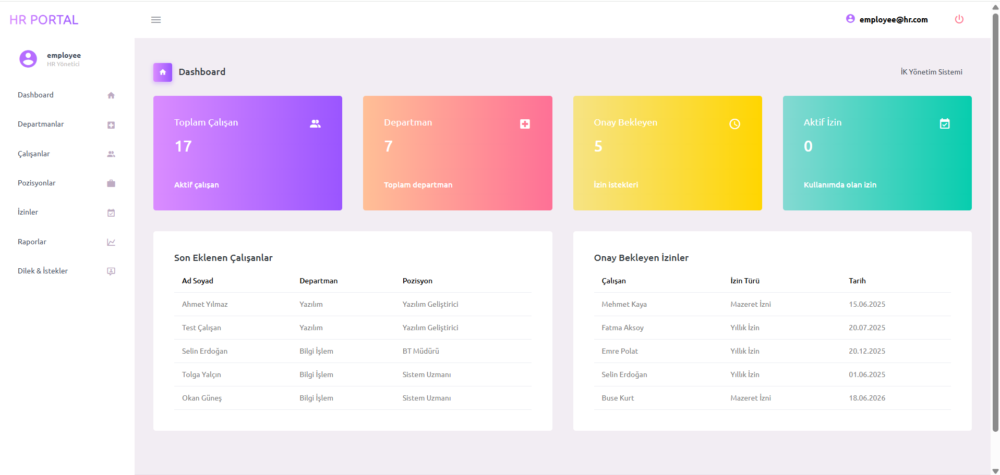
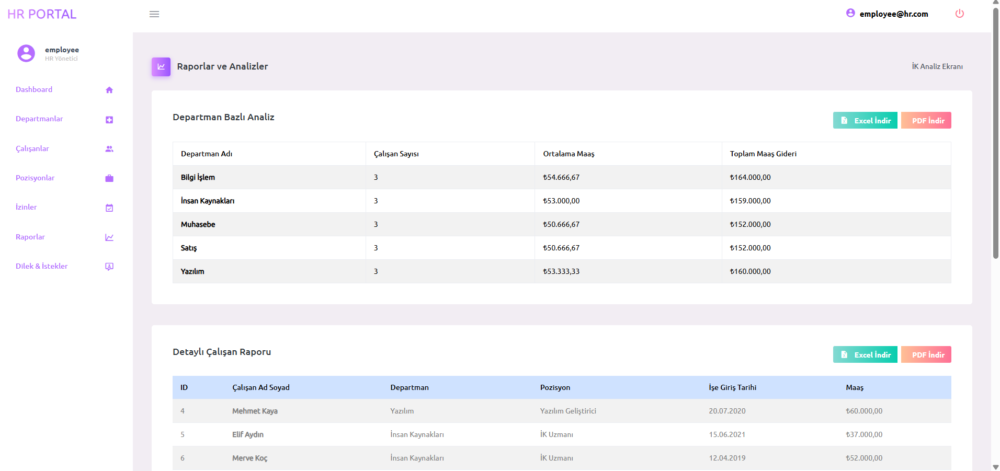
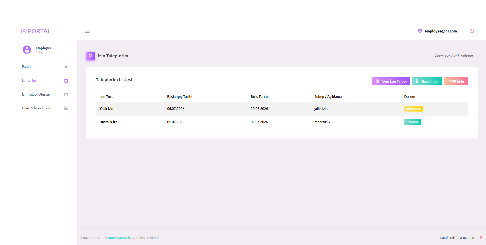
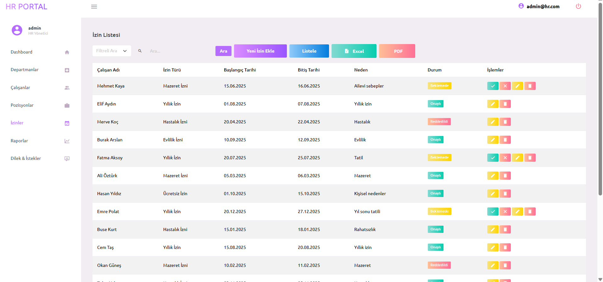
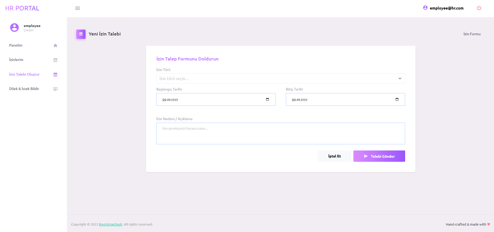

<h1 align="center">💼 HR Portal (Human Resources Management System)</h1>

<p align="center">
  <strong>SoftITO Backend Developer Eğitimi - 3. Proje / SoftITO Backend Developer Training - 3rd Project</strong><br>
  ASP.NET Core MVC (Database First) tabanlı modern İnsan Kaynakları Yönetim Portalı.
</p>

<p align="center">
  
  
  
  
  
</p>

<p align="center">
  <a href="#-türkçe">🇹🇷 Türkçe</a> • <a href="#-english">🇬🇧 English</a>
</p>

---

# 📸 Screenshots / Ekran Görüntüleri

### 🏠 Admin Dashboard (Yönetici Paneli)
<p align="center">
  
</p>

### 📊 Raporlar ve Analizler (LINQ Group By & Join)
<p align="center">
  
</p>

### 📝 İzin Talepleri Listesi (Yönetici Arayüzü)
<p align="center">
  
</p>

### ⚙️ İzin Talebi Detaylı İnceleme
<p align="center">
  
</p>

### 👤 Çalışan İzin Talep Ekranı
<p align="center">
  
</p>

---

## 🇹🇷 Türkçe

Bu proje, **SoftITO Backend Developer Eğitimi** kapsamında geliştirilen **3. projedir**. Database First yaklaşımıyla tasarlanan sistem, bir şirketin İnsan Kaynakları departmanının çalışan, departman, pozisyon ve izin süreçlerini yönetmesini amaçlar.

### 🌟 Öne Çıkan Özellikler
* **Tam CRUD İşlemleri:** Çalışanlar, departmanlar, pozisyonlar ve izinler üzerinde tam ekleme, okuma, güncelleme ve silme (silme işlemlerinde veri güvenliği için soft-delete uygulanmıştır) işlemleri.
* **Gelişmiş Arama & Filtreleme:** Listeleme ekranlarında alan bazlı veya genel arama desteği.
* **Detaylı Raporlar:**
  * **Group By Sorguları:** Departman bazlı çalışan sayıları, ortalama maaşlar ve toplam maaş giderleri analizi.
  * **Join Sorguları:** Çalışan, departman ve pozisyon tabloları birleştirilerek hazırlanan detaylı çalışan listesi raporu.
* **Excel & PDF Çıktısı:** Rapor ve veri tablolarını client-side kütüphaneleri (SheetJS ve jsPDF) kullanarak anında Excel (.xlsx) veya PDF (.pdf) formatında indirme imkanı.
* **Çift Panel Desteği:**
  * **Yönetici Paneli (Admin):** Tüm çalışan süreçlerini, izin taleplerini onay/ret durumlarını ve raporları yönetir.
  * **Çalışan Paneli (Employee):** Çalışanların kendi profil bilgilerini görmesini, şikayet/öneri göndermesini ve yeni izin talepleri oluşturmasını sağlar.

### 🔑 Test Kullanıcı Bilgileri
* **Yönetici (Admin):**
  * **E-posta:** `admin@hr.com`
  * **Şifre:** `Admin123!`
* **Çalışan (Employee):**
  * **E-posta:** `employee@hr.com` veya `ahmet.yilmaz@hr.com`
  * **Şifre:** `Employee123!` veya `Ahmet123!`

### 🚀 Kurulum Adımları
1. Projeyi klonlayın:
   ```bash
   git clone https://github.com/kullaniciadi/HumanResourcesDBFirst.git
   cd HumanResourcesDBFirst
   ```
2. Yerel veritabanı bağlantı ayarınızı yapın:
   * Projedeki `appsettings.template.json` dosyasını kopyalayıp `appsettings.json` adıyla kaydedin.
   * `ConnectionStrings:Default` altındaki `Server=YOUR_SERVER_NAME` alanına kendi SQL Server adresinizi yazın.
3. Bağımlılıkları geri yükleyin ve veritabanını oluşturun:
   ```bash
   dotnet restore
   dotnet ef database update
   ```
4. Projeyi çalıştırın:
   ```bash
   dotnet run
   ```

---

## 🇬🇧 English

This project is the **3rd project** developed under the **SoftITO Backend Developer Training**. Designed using the Database First approach, the system aims to manage the employees, departments, positions, and leave processes of a company's Human Resources department.

### 🌟 Key Features
* **Full CRUD Operations:** Full create, read, update, and delete (soft-delete applied for data safety) operations on employees, departments, positions, and leaves.
* **Advanced Search & Filtering:** Field-specific or general search support on listing tables.
* **Detailed Reports:**
  * **Group By Queries:** Analysis of employee counts, average salaries, and total salary expenses grouped by departments.
  * **Join Queries:** A detailed employee report combining data from Employees, Departments, and Positions tables.
* **Excel & PDF Export:** Instantly download report and data tables in Excel (.xlsx) or PDF (.pdf) format using client-side libraries (SheetJS & jsPDF).
* **Dual-Panel Support:**
  * **Admin Panel:** Manages all employee processes, leave approval/rejections, and analytics.
  * **Employee Panel:** Allows employees to view their own profile, submit requests/suggestions, and request new leaves.

### 🔑 Test Credentials
* **Admin User:**
  * **Email:** `admin@hr.com`
  * **Password:** `Admin123!`
* **Employee User:**
  * **Email:** `employee@hr.com` or `ahmet.yilmaz@hr.com`
  * **Password:** `Employee123!` or `Ahmet123!`

### 🚀 Installation Steps
1. Clone the project:
   ```bash
   git clone https://github.com/username/HumanResourcesDBFirst.git
   cd HumanResourcesDBFirst
   ```
2. Configure the database connection:
   * Copy `appsettings.template.json` and rename it to `appsettings.json`.
   * Replace `Server=YOUR_SERVER_NAME` under `ConnectionStrings:Default` with your SQL Server server name.
3. Restore dependencies and update the database:
   ```bash
   dotnet restore
   dotnet ef database update
   ```
4. Run the project:
   ```bash
   dotnet run
   ```